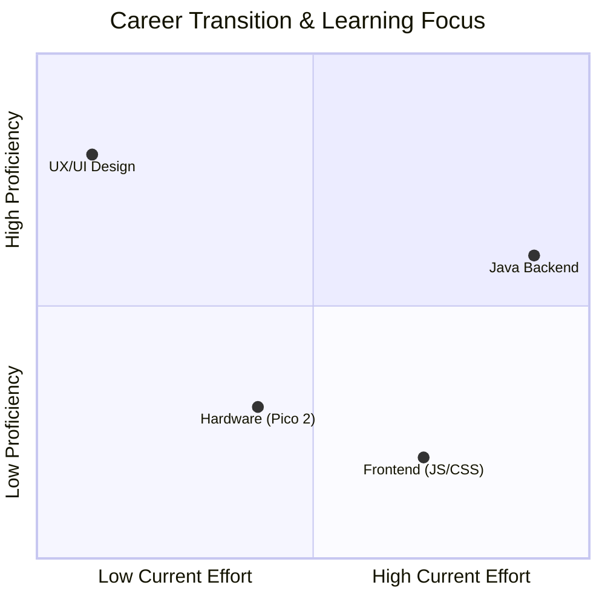

# Hi, I'm Andrés! 👋

I spent the last 4 years obsessed with how users feel when they click a button, open pop-ups and other stuff. Now, I’m diving under the hood to build the logic that makes those things actually work. I’m transitioning from designing the interface to architecting the systems behind it.

### 🛠️ What’s on my desk right now
* **Java Backend:** Currently in an intensive bootcamp, mastering design patterns, clean code, and robust architectures.
* **Java Practice:** I enjoy solving logic challenges and building small utility scripts in my spare time. You can find repositories on my profile filled with these ideas and exercises where I test new concepts.
* **Hardware Tinkering:** Bridging the gap between code and the physical world with my **Raspberry Pico 2**. If it has a sensor and can be automated, I’m probably messing with it.

---

### ☕ The Java Shift
I am focusing on building a rock-solid backend foundation. I am moving away from visual prototypes to focus on the "engine" that powers the experience:
* **Clean Code & Patterns:** Applying SOLID principles and design patterns to write professional, maintainable Java.
* **Reliability:** Implementing Test-Driven Development (TDD) to ensure my backend logic is stable and scalable.
* **Constant Practice:** My spare time is dedicated to solving exercises that sharpen my understanding of data structures and object-oriented programming.

### 🎨 Frontend Experiments 
When I get bored of the backend, I like to practice my frontend skills—even if they’re still a work in progress. After years of drag-and-drop in Figma, actually coding a layout can feel a bit incoherent at times, but I’m pushing through the learning curve. You’ll find some repositories where I’m experimenting with HTML, CSS, and trying to figure out how JavaScript actually works. Wish me luck!

### 🔌 Hardware & Logic Labs
I use my **Raspberry Pi Pico 2** as a sandbox for low-level programming. My repository, **Pico Learning Labs**, documents my journey from basic signals to complex hardware interactions:
* **Signal Processing:** Handling **ADC (Analog-to-Digital)** and **PWM (Pulse Width Modulation)** to interpret sensors and control hardware with precision.
* **GPIO Architecture:** Managing pin configurations and interrupt logic to build reactive, real-world systems.
* **MicroPython:** Prototyping fast-reacting systems that bridge the gap between software and physical components.

---

---

### 🏃‍♂️ Away from the screen
When the IDE is closed, I am usually pushing my physical limits in **Vienna**:
* **Running:** Training for a future Marathon. It requires the same discipline as coding.
* **Soccer:** My favorite way to reset my brain and stay active.

---
### 🤝 Let's connect
* 💼 **LinkedIn:** [Andrés Bejarano](https://www.linkedin.com/in/andres-bejarano-hey/)
